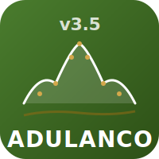

<p align="center">
  
</p>

<h1 align="center">Adulanco 3.5</h1>

<p align="center">
  Simulador de faixa de aplicação de fertilizante sólido<br>
  <em>Solid fertilizer distribution pattern simulator</em>
</p>

<p align="center">
  <a href="https://adulanco-open.cloud">Demo ao vivo</a>
</p>

---

## O que é

O Adulanco calcula o **Coeficiente de Variação (CV%)** da distribuição transversal de fertilizante sólido, simulando a sobreposição de passadas em três sistemas:

- **Alternado Direito** — vai / vem / vai (larguras assimétricas)
- **Alternado Esquerdo** — vem / vai / vem
- **Contínuo** — vai / vai / vai

A partir dos dados coletados em bandejas no campo, o app determina as **larguras ótimas de trabalho** para cada sistema.

## Funcionalidades

- Entrada de dados apenas para coletores reais (interpolação automática)
- Cálculo de CV% para todas as larguras de trabalho possíveis
- Detecção automática de larguras ótimas (mínimos locais de CV)
- Gráfico CV x Largura de trabalho
- Perfil de distribuição (histograma)
- Simulação visual com 3 passadas (canvas)
- Relatório PDF para impressão
- PWA — funciona 100% offline após primeiro acesso
- Sem dependências de servidor — roda direto no navegador

## Como usar

### Online (GitHub Pages)
Acesse: **https://adulanco-open.cloud**

### Local
1. Clone o repositório:
   ```bash
   git clone https://github.com/gussfb/adulanco.git
   ```
2. Abra `index.html` no navegador — funciona direto, sem build.

## Parâmetros de entrada

| Parâmetro | Descrição | Exemplo |
|-----------|-----------|---------|
| Nº de coletores | Bandejas reais no campo | 13 |
| Largura da bandeja | Em centímetros | 50 cm |
| Espaçamento | Vão entre bandejas (cm) | 200 cm |
| Repetições | Quantas coletas | 1-20 |
| Passadas | Nº de passadas na simulação | 3 |
| Coletor central | Bandeja sob o centro do distribuidor | 7 |

## Tecnologias

- HTML / CSS / JavaScript puro (sem frameworks)
- [Chart.js 4.4](https://www.chartjs.org/) para gráficos
- Canvas 2D para simulações visuais
- Service Worker para funcionamento offline

## Créditos

### Versão original — Adulanco 3.1 (Excel/VBA, 2004)
- **Autor**: Mark Spekken
- **Coordenação**: Prof. J.P. Molin
- **Colaboradores**: Coelho J.L.D., Gonçalves A.O., Menegatti L.A.A., Rozestraten H., Silva G.F., Sollero G.C., Spekken M., Vasarhelyi A.

### Versão web — Adulanco 3.5 (2025)
- **Autor**: [gussfb](https://github.com/gussfb) — reescrita completa em HTML/CSS/JS

## Contribuindo

Contribuições são bem-vindas! Abra uma [issue](https://github.com/gussfb/adulanco/issues) ou envie um pull request.

1. Fork o repositório
2. Crie sua branch (`git checkout -b minha-feature`)
3. Commit suas mudanças (`git commit -m 'Adiciona feature X'`)
4. Push (`git push origin minha-feature`)
5. Abra um Pull Request

## Licença

Este projeto é licenciado sob a **GNU General Public License v3.0** — veja o arquivo [LICENSE](LICENSE) para detalhes.
